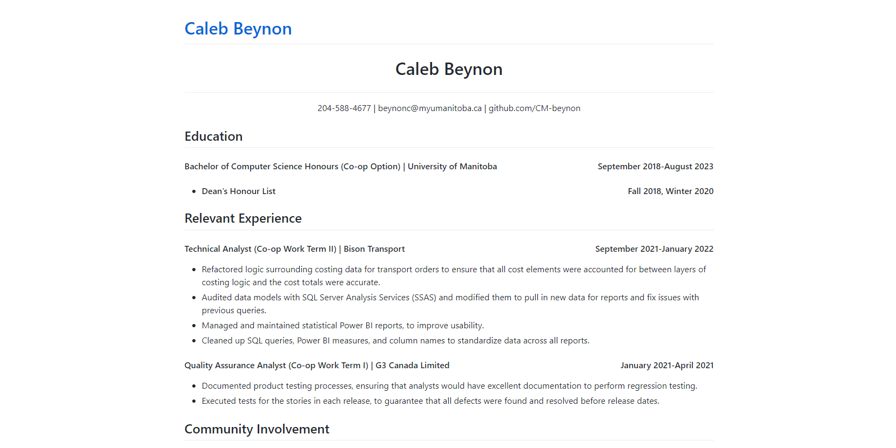

# How to host your resume on GitHub pages  
This guide will walk you through how to host your own resume on GitHub pages,  
using GitHub Flavoured Markdown and Jekyll.

## Prerequisites
You should have a resume formatted in Markdown prepared before following this tutorial.

## Instructions

### Getting Started with GitHub
1. Creating an account
    - To create a GitHub account, follow this <a href="https://docs.github.com/en/get-started/signing-up-for-github/signing-up-for-a-new-github-account">tutorial</a>.
2. Creating your GitHub pages repository
    - Select "Your repositories" from the dropdown
    - Select the "New" button
    - In the "Repository name" field enter <profileName>.github.io
    - Select "Public" as your pages repository will need to be public
    - Check the box next to "Add a README file"
    - Select the "Create repository" button

### Adding Your Resume
- Now on your new repository page, you will need to select "Add file".
- Then select "Create new file" from the following dropdown.
- Name this file "index.md". (This will be the file that contains your resume).
- Copy over the text (including the Markdown) from your Markdown formatted resume into this file.
- Scroll down to the bottom of this screen and under "Commit new file" write "Created index.md file" or some other meaningful commit message.
- Select "Commit new file", and you will be brought back to the repository page.

### Adding a config File
- Similarly to the previous section, you will need to select "Add file", then select "Create new file" from the dropdown.
- Name this file "_config.yml".
- Add the following text to the file "title: <Your Name>" this will replace the link at the top of your page to your name.
- Then scroll to the bottom of the screen, enter a meaningful commit message like you did in the last section, and select "Commit new file".

### Viewing Your Website
To view your website, type <profileName>.github.io into the search bar, and you will be brought to your page. It should look something like the following image.

## More Resources
- You can use the following <a href="https://www.markdownguide.org/getting-started/">tutorial</a>, to learn more about Markdown.
- You can read Etter's book on Modern Technical Writing <a href="https://www.amazon.ca/Modern-Technical-Writing-Introduction-Documentation-ebook/dp/B01A2QL9SS">here</a>.
- If you want to add different themes to your GitHub pages website, this is an excellent <a href="https://docs.github.com/en/pages/setting-up-a-github-pages-site-with-jekyll/adding-a-theme-to-your-github-pages-site-using-jekyll#customizing-your-jekyll-themes-html-layout">tutorial</a>.

## Authors and Acknowledgements
Author: Caleb Beynon

## FAQ
1. Why should I host my resume on GitHub pages?
    - Hosting your resume on GitHub pages builds your online presence and brand. Having this presence makes you more visible to potential employers. Not only that but it also demonstrates that you have some technical skills in your field.
2. How do I start using Jekyll?
    - By default Jekyll is enabled for GitHub pages, so if you followed this tutorial, you don't need to do any setup.
3. Why can I not see my resume when I go to my website?
    - Ensure that your resume file is named index.md, and that it is located in the root directory of your repository. Any errors in this section can result in your resume not showing up on your resume.
